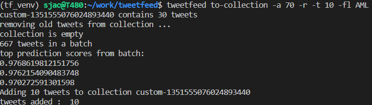
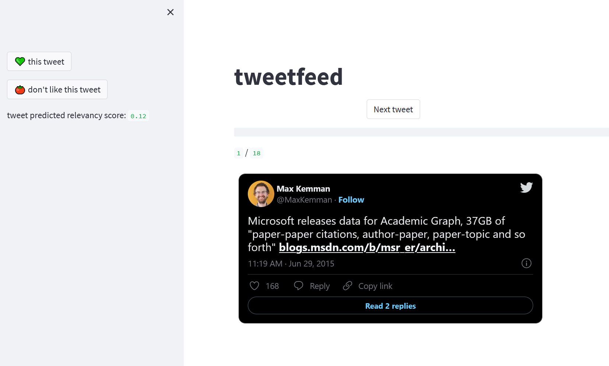
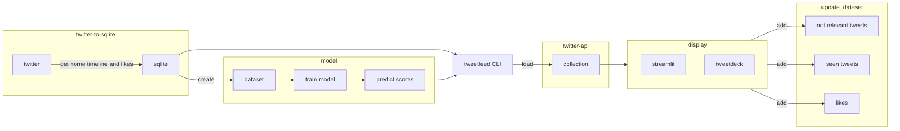
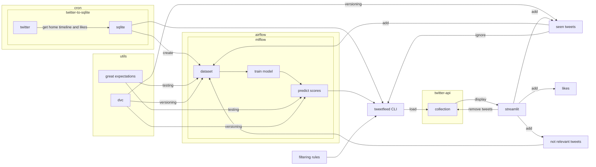
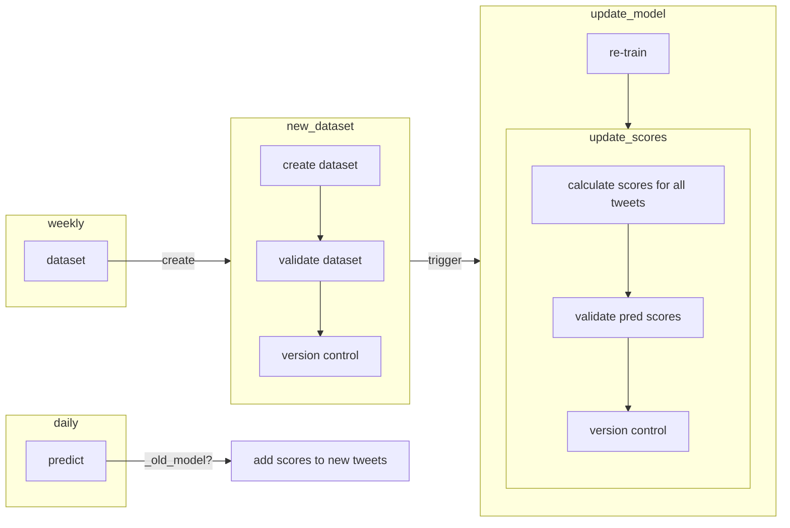

# Tweetfeed - re-imaging Twitter feed with ML
The motivation behind the project:

https://gsajko.github.io/projects/custom-twitter-feed-part1/

TLDR: Twitter feed sucks.

## Getting tweets to feed

In the background, I **rate the relevancy of tweets** and **remove "news-related" tweets**.

Using the `tweetfeed` CLI I load tweets to collection (with the most relevant loaded first).

Tweets can be loaded with custom rules.

`"--age", "-a"` How old (in days) should be the most recent tweet. Defaults to 21.

`"--reverse", "-r"` If chosen with `--age` parameter, no tweets older than age (in days) will be shown.

`"--tweets", "-t"` How many tweets upload to the collection.

`"--ignore_muted", "-im"` If `True` it prevents from using Twitter API and list functionality (muted accounts are stored in `muted` list).

`"--users_from_list", "-fl"` If chosen, it will only grab tweets from users in a named list.

`"--friends_only", "-fo"` If `True`, tweets by friends (following) will be added.

`"--not_friends_only", "-nfo"`  If `True`, only tweets by non-friends (who user does not follow) will be added.

`"--min_likes", "-l"`  Minimum number of likes a tweet must have to be added to the collection.

For example:

`tweetfeed to-collection -t 10 -a 70 -r -fl Q1` - load 10 tweets not older than 70 days, from users belonging to list `Q1`.

`tweetfeed to-collection -t 30 -a 70 -nfo` - load 30 tweets, older than 70 days, from users I don't follow (great for discovering new people).

## Display - Streamlit app
I wrote a simple Streamlit app to display one tweet at a time, NOT scrollable (Tik Tok style). Here is a demo of this app: 

👉[streamlit demo](https://gsajko-tweetfeed-st-app-add5rq.streamlitapp.com/)

## Data/ML Pipeline

I use `twitter-to-sqlite` to get tweets (home timeline and my likes) and I store them in SQLite database.

From that database I extract tweets:
- I engaged with
- I have seen
- I find tweets that link to news sites, and label them as negative

I create a dataset of negative and positive sentiments, based on my engagement. 

Using that dataset I train simple logistic regression, and use it as a ranking function.

Then I use that model, to predict sentiment score on all tweets in the database. 

After that, I leverage Twitter "collection" functionality. zzz

After tweets are loaded in a collection, I can view the collection either in Twitter's Tweetdeck, or in Streamlit app. 

After viewing tweets, I like some of them, I label some of them as not relevant. All tweets are added to `seen.csv` - I track all tweets I have seen already.

All of this data will be used, to update the dataset later.

/ in the demo I used tweets that I use for testing different functionality (mostly filtering out tweets that contain links to news sites) /

### More accurate data/ML pipeline
(but less clear, and less readable)

## Airflow workflows

## Future improvement:
- refractor code
- use a model to predict, if the tweet is news related
- use a more sophisticated model for recommendations