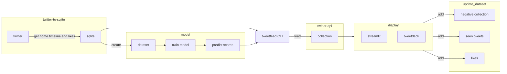
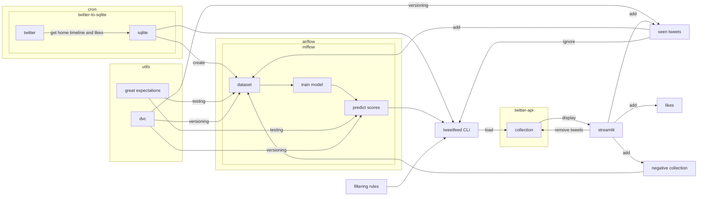
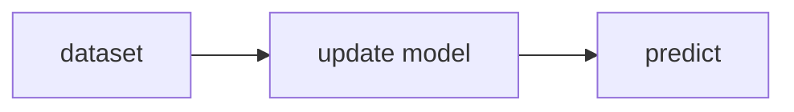
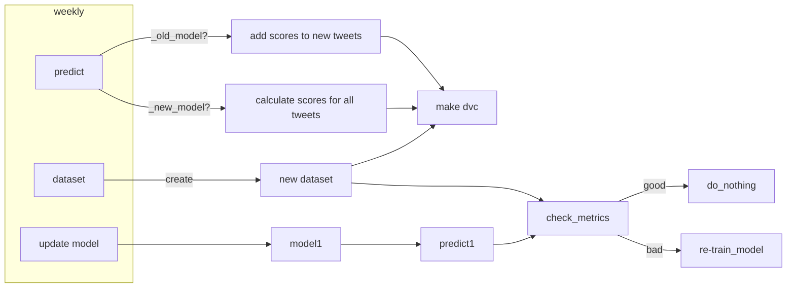

I use twitter-to-sql to get tweets (home timeline and my likes) and I store them in Sqlite database.

From that database I extract tweets:
- I engaged with
- I have seen
- I find tweets that link to news sites, and label them as negative

I create dataset of negative and positive sentiment. 

Using that dataset I train simple logistic regression, and use it as a ranking function.

Then I use that model, to predict sentiment score on all tweets in the database. 

After that, I laverage twitter "collection" functionality. Using tweetfeed CLI I load tweets to collection. Tweets can be loaded on many custom rules. For example:

==example==

After tweets are loaded in collection, I can view the collection either in Twitter's Tweetdeck, or in Streamlit app. 

I wrote simple Streamlit app to display one tweet at the time, NOT scrollable. Here is a demo of this app: 

==link==

[streamlit demo](https://gsajko-tweetfeed-st-app-add5rq.streamlitapp.com/)

/ in demo I used tweets that I use for testing different functionality (mostly filtering out tweets that contain links to news sites) /

After viewing tweets, I like some of them, I label some of them as not relevant. All tweets are added to `seen.csv` - I track all tweets I seen already.

All of this data will be used, to update dataset later.

AIRFLOW

two things #TODO
- check if new model is better than old one
- check if there is new model, or the old model

Future impromvent:
- refractor code
- use model to predict, if tweet is news related
- use more sofisticated model for recommendations