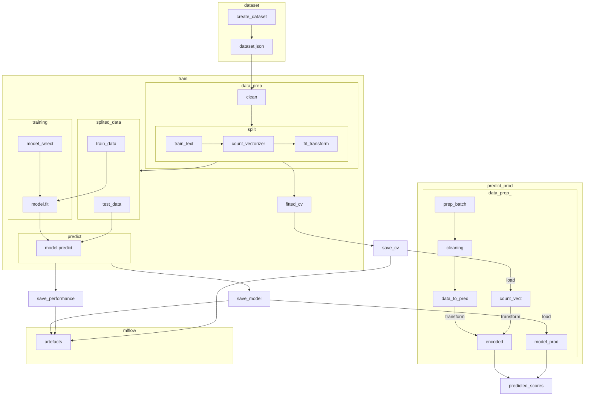

```mermaid
flowchart

cv[count_vectorizer]

subgraph dataset
d1[dataset.json]
create_dataset --> d1
end

subgraph train

subgraph data_prep
d1 --> clean --> split
end

subgraph split
train_text --> cv
cv --> fit_transform
end

split --> splited_data & fitted_cv

subgraph splited_data
test_data & train_data
end


subgraph training
model_select --> model.fit
train_data --> model.fit
end

subgraph predict
model.fit --> model.predict
test_data --> model.predict
end

end

subgraph predict_prod

subgraph data_prep_
prep_batch --> cleaning --> data_to_pred
data_to_pred & count_vect --transform--> encoded
model_prod
end


end


save_cv --load--> count_vect

subgraph mlflow
artefacts
end

predict --> save_model & save_performance
fitted_cv --> save_cv
encoded & model_prod --> predicted_scores
save_model & save_performance & save_cv --> artefacts

save_model --load--> model_prod

```

