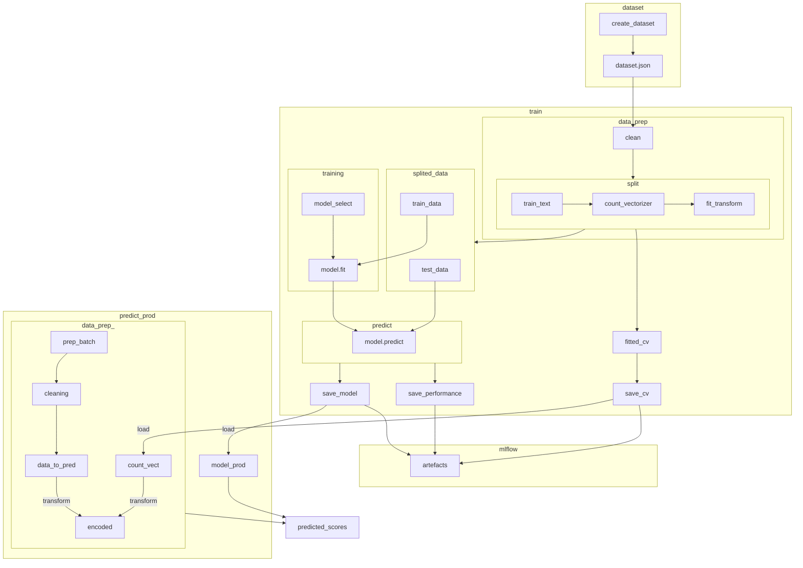

```mermaid
flowchart

cv[count_vectorizer]

subgraph dataset
d1[dataset.json]
create_dataset --> d1
end

subgraph train

subgraph data_prep
d1 --> clean --> split
end

subgraph split
train_text --> cv
cv --> fit_transform
end

split --> splited_data & fitted_cv

subgraph splited_data
test_data & train_data
end

fitted_cv --> save_cv


subgraph training
model_select --> model.fit
train_data --> model.fit
end

subgraph predict
model.fit --> model.predict
test_data --> model.predict
end
predict --> save_model & save_performance
end

subgraph predict_prod

subgraph data_prep_
prep_batch --> cleaning --> data_to_pred
data_to_pred & count_vect --transform--> encoded
end

save_model --load--> model_prod

end


save_cv --load--> count_vect

subgraph mlflow
save_model & save_performance & save_cv --> artefacts
end

data_prep_ & model_prod --> predicted_scores

```